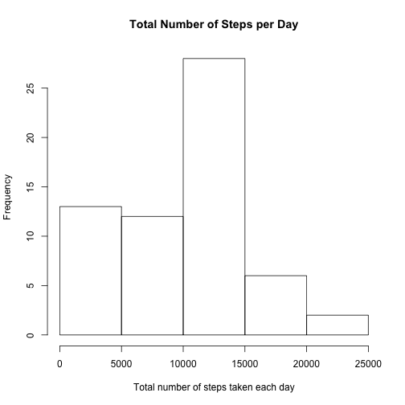
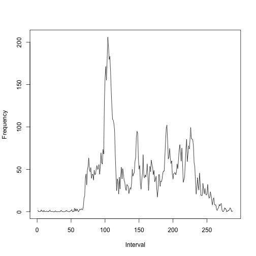
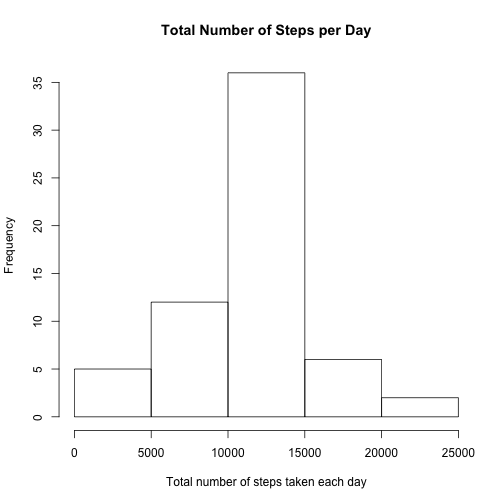
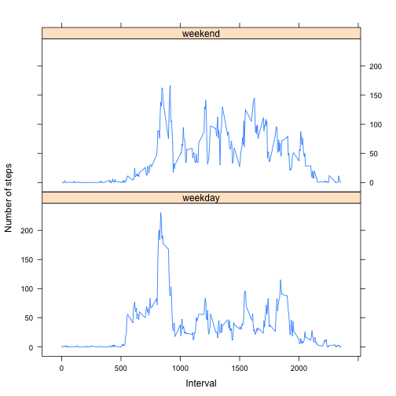

##Loading and preprocessing the data
Load the activity dataset into R and review the dataset


```r
setwd("/Users/Hanyao/Desktop")
activity<-read.csv("activity.csv")
head(activity)
```

```
##   steps       date interval
## 1    NA 2012-10-01        0
## 2    NA 2012-10-01        5
## 3    NA 2012-10-01       10
## 4    NA 2012-10-01       15
## 5    NA 2012-10-01       20
## 6    NA 2012-10-01       25
```

## What is the mean total number of steps taken per day (ignoring the missing values in the data set)?
Calculate the total number of steps taken per day.


```r
numstepday<-tapply(activity$steps,activity$date,sum,na.rm=TRUE)
```

Let's look at the histogram of the total number of steps taken each day.


```r
hist(numstepday,xlab="Total number of steps taken each day",main="Total Number of Steps per Day")
```

 

Report the mean and median of the total number of steps taken each day


```r
mean(numstepday)
```

```
## [1] 9354.23
```

```r
median(numstepday)
```

```
## [1] 10395
```

##What is the average daily activity pattern?
This is a time series plot of the 5-minute interval and the average number of steps taken, averaged across all days.


```r
avgstep5min<-tapply(activity$steps,activity$interval,mean,na.rm=TRUE)
plot(avgstep5min,type="l",ylab="Frequency",xlab="Interval")
```

 

Find out the 5-minite interval that contains the maximum number of steps.


```r
names(which.max(avgstep5min))
```

```
## [1] "835"
```

##Imputing the missing values and recalcuate the total number of steps taken each day
Here is the total number of missing values in the activity dataset


```r
sum(1-complete.cases(activity))
```

```
## [1] 2304
```

Impute the missing values with the group mean for the 5-minute interval. Create a new dataset that is equal to the original data but with missing values filled in.


```r
library(plyr)
impute.mean<-function(x) replace(x,is.na(x),mean(x,na.rm=TRUE))
activity2<-ddply(activity,~interval,transform,steps=impute.mean(steps))
row.names(activity2)<-c(1:nrow(activity2))
```

Let's look at the histogram of the total number of steps taken each day again.


```r
numstepday<-tapply(activity2$steps,activity2$date,sum,na.rm=TRUE)
hist(numstepday,xlab="Total number of steps taken each day",main="Total Number of Steps per Day")
```

 

Recalculate the mean and median of the total number of steps taken each day.


```r
mean(numstepday)
```

```
## [1] 10766.19
```

```r
median(numstepday)
```

```
## [1] 10766.19
```

We can tell both the mean and median are higher than before.

##Are there differences in activity patterns between weekdays and weekends?
Create a new factor variable in the dataset with two levels-"weekday" and "weekend".


```r
activity2$weekday<-weekdays(strptime(activity2$date,format="%Y-%m-%d"))
for (i in 1:nrow(activity2)) {
    if(activity2$weekday[i]=="Saturday"|activity2$weekday[i]=="Sunday") {
        activity2$weekday[i]<-"weekend"
       }
    else activity2$weekday[i]<-"weekday"
}
activity2$weekday<-factor(activity2$weekday)
```

This is a panel plot containing a time series plot of the 5-minute interval and the average number of steps taken, averaged across all weekday days or weekend days.


```r
library(lattice)
stepwk <- aggregate(steps ~ interval + weekday, data = activity2, mean)
names(stepwk) <- c("interval", "weekday", "steps")
xyplot(steps ~ interval | weekday, stepwk, type = "l", layout = c(1, 2), 
       xlab = "Interval", ylab = "Number of steps")
```

 
